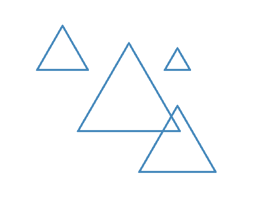

# Introducción a Python

## Semana 5
<!-- .element style="text-align:center" -->

 <!-- .element style="margin-left: auto; margin-right: auto; display: block" -->

---

# Enlaces:


- Tortuga: [https://pythonandturtle.com/turtle](https://pythonandturtle.com/turtle)
- Repl: [https://www.pythonmorsels.com/repl/](https://www.pythonmorsels.com/repl/)
- Presentaciones de las semanas anteriores:
  - [https://avast-python.github.io/semana-1](https://avast-python.github.io/semana-1)
  - [https://avast-python.github.io/semana-2](https://avast-python.github.io/semana-2)
  - [https://avast-python.github.io/semana-3](https://avast-python.github.io/semana-3)
  - [https://avast-python.github.io/semana-4](https://avast-python.github.io/semana-4)


---

### La programación son cinco cosas

1. ~~Secuencia~~ ✓
2. Condicionales <-
3. ~~Repetición~~ ✓
4. ~~Variables~~ ✓
5. Funciones <-
---

# Condicionales

```python
if ALGO_BOOLEANO:
    secuencia_instrucciones_1
elif OTRA_CONDICION:
    secuencia_instrucciones_2
elif OTRA_CONDICION_MAS:
    secuencia_instrucciones_3
else:
    secuencia_instrucciones_4
```
<!-- .element style="font-size: 1em" -->

- Sirven para "bifurcar" el código
- El `elif` y el `else` son opcionales
- Normalmente usaremos variables en las condiciones
- Podéis hacer diagramas de bloques para ver el flujo del programa

---

# Ejemplo de condicionales

```python
if numero % 2 == 0:
    print('OLA K ASE')
```
<!-- .element style="font-size: 1em" -->

¿Qué imprimirá cuando numero vale 6?

¿Y cuando vale 5?
---

# Otro ejemplo de condicionales

```python
if numero > 10:
    print('El número es grande')
elif numero > 100:
    print('El número es muy grande')
else:
    print('El número es una caca')
```
<!-- .element style="font-size: 1em" -->

¿Qué imprimirá con los siguientes números?
- 10
- 101
- 34

---

# Ejercicio 1

 <!-- .element class="noborder center" -->

**Extra**: Haz el dibujo que tiene varias líneas

---

# Funciones

```python
# Definición de función
def saludar(nombre):
    print('¡Hola, '+ nombre + '!')

```
<!-- .element style="font-size: 0.8em" -->

```python
# Llamada a función
saludar('Pepe')
saludar('Juan')

# Esto no haría lo que esperas:
saludar
```
<!-- .element style="font-size: 0.8em" -->

- Una función es un nombre para un conjunto de instrucciones
- Hay que definirlas primero
- Se le pueden pasar parámetros
- Podemos utilizarlas todas las veces que queramos
- Sirven para dos cosas:
  - Reutilizar código
  - Hacer el programa más claro

---

# Ejemplo

 <!-- .element class="noborder center" -->

---

# Ejercicio 2

 <!-- .element class="noborder center" -->

¿Qué cosas podríamos definir como funciones en cada dibujo?

